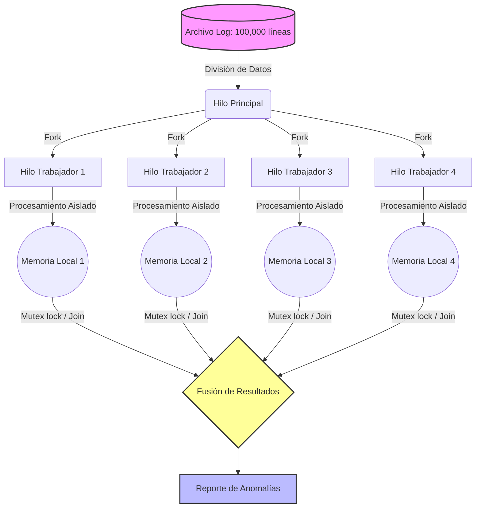

# Mini-IDS: Motor Paralelo de Detección Proactiva de Amenazas
## Análisis del problema
### **Infraestructuras de Alta Densidad:**
En las redes modernas, cada interacción deja un rastro. Ya sea en el nodo central de distribución de una organización o en la arquitectura en la nube de un servicio en línea, los enrutadores y firewalls generan bitácoras de tráfico (logs) de forma incesante. Estos registros son la primera línea de visibilidad para cualquier sistema de defensa proactiva.

Sin embargo, cuando ocurre un evento anómalo, como un escaneo masivo de puertos para buscar vulnerabilidades o un ataque de denegación de servicio (DDoS), el volumen de estas bitácoras explota, generando millones de registros por minuto. La capacidad de reaccionar ante una amenaza depende directamente de la velocidad con la que se pueda leer, procesar y entender esta avalancha de información.

### **El Cuello de Botella Secuencial:**
El análisis tradicional de bitácoras de red se enfrenta a un límite físico ineludible. Si un programa lee un archivo de registro línea por línea desde el principio hasta el final (procesamiento secuencial), el tiempo necesario para encontrar un patrón de ataque crece linealmente con el tamaño del archivo.

Para un archivo de unos pocos megabytes, esto toma fracciones de segundo. Para gigabytes de tráfico de red en tiempo real, el motor de detección se vuelve un cuello de botella. Mientras el sistema sigue leyendo las primeras líneas del registro, el atacante ya ha comprometido la red.

En términos simples: Es el equivalente a intentar encontrar una palabra específica en una enciclopedia de mil páginas leyendo cada página tú solo, una por una.

### **Deconstrucción Lógica y Procesamiento Simultáneo:**
Este proyecto aborda el cuello de botella aplicando una metodología de deconstrucción lógica sobre los datos mediante el uso estricto del paradigma de programación en paralelo utilizando C++.

En lugar de leer el flujo de red de forma lineal, el motor:

1. **Calcula la masa de datos:** Analiza el tamaño total de la bitácora de red.

2. **Deconstruye la carga:** Fragmenta el archivo masivo en bloques lógicos independientes.

3. **Distribuye el esfuerzo:** Asigna cada bloque a un hilo de procesamiento distinto (thread) dentro del procesador multi-núcleo.

4. **Sintetiza la amenaza:** Cada hilo reporta sus hallazgos de forma concurrente, fusionando los resultados en un único reporte de anomalías en una fracción del tiempo original.

## Arquitectura del Sistema

Para lograr una defensa proactiva eficiente, el motor evita el análisis lineal tradicional y emplea una arquitectura de procesamiento paralelo de datos. La solución se fundamenta en la deconstrucción lógica del flujo de información, dividiendo el problema masivo en sub-tareas computacionales autónomas que se ejecutan simultáneamente.

### 1. Ingesta y Modelado de Datos
El sistema recibe bitácoras de tráfico de red en texto plano (archivos `.log`). Para mantener la eficiencia espacial y temporal, cada línea se modela internamente extrayendo únicamente los datos clave para la detección de anomalías:

- `Timestamp` (Marca de tiempo)

- `Source_IP` (Dirección IP de origen)

- `Target_Port` (Puerto de destino)

### 2. Cómo Funciona el Trabajo en Paralelo (División y Conquista)
El programa en C++ está diseñado para aprovechar todos los núcleos de tu computadora al mismo tiempo, haciendo que trabajen en equipo. Se divide en tres pasos muy sencillos:

**1. Repartición (Dividir):** El programa analiza el tamaño total del archivo de bitácoras y lo corta en pedazos del mismo tamaño. Le asigna un pedazo distinto a cada núcleo de la computadora.

​**2. Análisis Independiente (Procesar):** Cada hilo lee y cuenta las conexiones sospechosas exclusivamente dentro de su propio pedazo. Como cada quien tiene su propia sección del archivo, no se estorban entre ellos y pueden trabajar a su máxima velocidad al mismo tiempo.

​**3. Fusión de Resultados (Unir):** Cuando todos los hilos terminan de leer su parte, deben juntar sus detecciones en un solo reporte final. Para evitar que choquen entre ellos o sobrescriban la información del otro al entregar sus resultados, el programa usa un sistema de turnos automáticos (conocido técnicamente como mutex), garantizando que la suma matemática sea exacta y sin errores.

### ​3. Diagrama Visual de la Solución
[]imagen

*El diagrama ilustra cómo el archivo original se fragmenta, cómo cada trabajador de la computadora analiza su parte de forma aislada, y cómo al final todos convergen para armar el reporte de resultados de forma ordenada.*

## Análisis de Rendimiento y Contraste de Arquitecturas
​Para justificar la viabilidad de este motor de defensa, es fundamental entender el impacto del volumen de datos en el tiempo de respuesta y por qué se descartaron otros enfoques de diseño.

### Complejidad Computacional (El Rendimiento):
​El rendimiento de un algoritmo se mide por cómo se comporta cuando la cantidad de trabajo aumenta. En el análisis de bitácoras de red:

- **Enfoque Tradicional (Secuencial):** Su complejidad temporal es de O(N), donde N es el número total de líneas en el registro. Si el archivo duplica su tamaño, el tiempo de procesamiento se duplica. Es una relación rígida y peligrosa bajo ataques de red severos.

- **Paralelo:** Al dividir el archivo, la complejidad temporal teórica se reduce a O(N/P), donde P representa el número de núcleos o hilos de procesamiento disponibles. Aunque existe un costo mínimo de tiempo al unir los resultados al final, el tiempo de respuesta del motor se vuelve drásticamente más rápido cuanta más capacidad de hardware se le asigne.

### Contraste de Diseño: Paradigma Paralelo vs. Paradigma Lógico
​Durante el diseño de la solución, se evaluó modelar el problema utilizando el Paradigma Lógico (específicamente mediante el lenguaje Prolog). Este enfoque funciona como un "libro de reglas" en lugar de una línea de ensamblaje.

​En un modelo lógico, no le decimos a la computadora cómo procesar los datos paso a paso, sino que definimos qué es una anomalía. Por ejemplo, podríamos declarar una regla que diga: *"Si una misma dirección IP intenta conectarse a más de 100 puertos distintos en un minuto, entonces es un escaneo de puertos"*.

**​¿Por qué se descartó para la implementación principal?**

- ​**Ventaja del modelo lógico:** Es extremadamente elegante para definir escenarios de ataque complejos con muy pocas líneas de código.
- **​Desventaja crítica:** Su motor interno busca respuestas haciendo coincidir patrones mediante prueba y error (recursión y backtracking). Si intentamos cargar una bitácora de red de millones de líneas en un sistema lógico, la complejidad espacial (el uso de la memoria RAM) colapsaría, y el tiempo de procesamiento sería inviable para una respuesta en tiempo real.

El paradigma lógico es excelente para sistemas expertos que diagnostican amenazas en un entorno controlado, pero para procesar la fuerza bruta de una avalancha de datos en crudo, el paralelismo de C++ es la herramienta adecuada para el trabajo.

## Implementación del Paradigma y Modelado Visual
Para ilustrar la separación de la memoria y la convergencia de los hilos de procesamiento, el siguiente diagrama refleja el flujo de ejecución concurrente implementado en el sistema:

## Pruebas Automatizadas y Validación
El motor fue desarrollado en C++14. Al compilar y ejecutar el proyecto, el sistema realiza automáticamente una validación de integridad (Unit Test) de caja blanca para asegurar la fiabilidad de la detección.

### **Mecánica de la Prueba:**

**1. Generación Sintética:** El programa autogenera un archivo network_log.txt de 100,000 líneas simulando tráfico normal.

**2. Inyección de la Amenaza:** Se inyecta de forma determinista un ataque DDoS originado desde la dirección IP 192.168.1.100.

**3. Validación Lógica:** Se utiliza la macro de diagnóstico assert() para comparar el resultado analítico del motor paralelo contra la firma del atacante inyectado. Si el motor falla en detectarlo, el hilo principal aborta la ejecución inmediatamente, previniendo falsos positivos.

**4. Evidencia de Rendimiento:** Al finalizar exitosamente, el programa imprime un reporte en consola comparando la latencia en milisegundos del análisis secuencial contra el paralelo.
